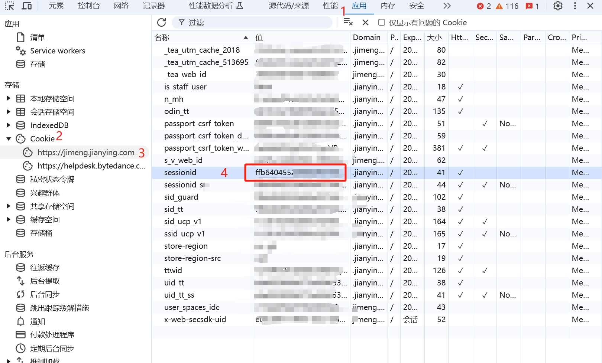
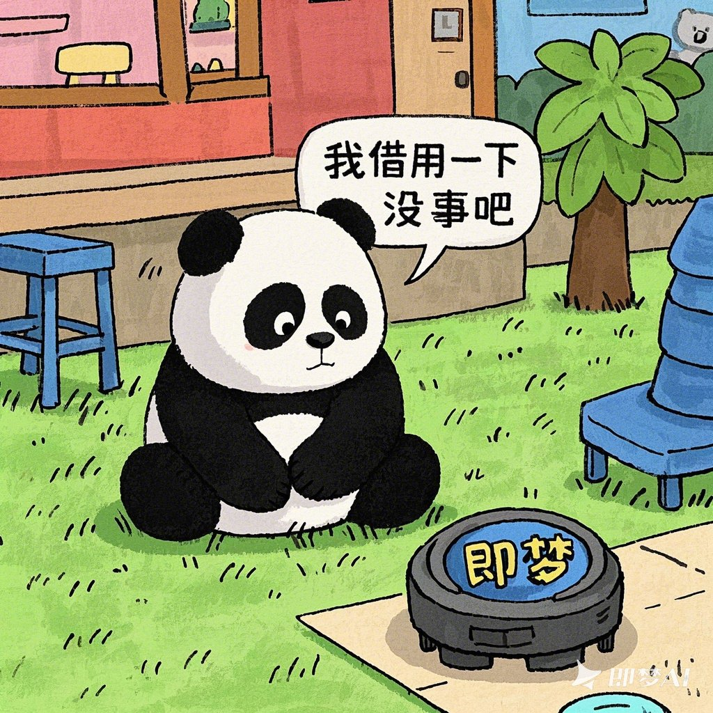

# Jimeng AI Free 服务

[](LICENSE)


支持即梦超强图像生成能力，最新图像3.1模型，视频生成模型（目前官方每日赠送 66 积分，可生成 66 次），零配置部署，多路 token 支持。

与 OpenAI 接口完全兼容。


## 免责声明

**逆向 API 是不稳定的，建议前往即梦 AI 官方 https://jimeng.jianying.com/ 体验功能，避免封禁的风险。**

**本组织和个人不接受任何资金捐助和交易，此项目是纯粹研究交流学习性质！**

**仅限自用，禁止对外提供服务或商用，避免对官方造成服务压力，否则风险自担！**

**仅限自用，禁止对外提供服务或商用，避免对官方造成服务压力，否则风险自担！**

**仅限自用，禁止对外提供服务或商用，避免对官方造成服务压力，否则风险自担！**

## 接入准备

从 [即梦](https://jimeng.jianying.com/) 获取 sessionid

进入即梦登录账号，然后 F12 打开开发者工具，从 Application > Cookies 中找到`sessionid`的值，这将作为 Authorization 的 Bearer Token 值：`Authorization: Bearer sessionid`



### 多账号接入

你可以通过提供多个账号的 sessionid 并使用`,`拼接提供：

`Authorization: Bearer sessionid1,sessionid2,sessionid3`

每次请求服务会从中挑选一个。

## 效果展示

```text
可爱的熊猫漫画，熊猫看到地上有一个叫“即梦”的时间机器，然后说了一句“我借用一下没事吧”
```



使用chat接口调用视频生成模型，chat接口中使用视频生成模型
```text
生成一个小孩吃西瓜的视频，坐在瓜地里”
```


## Docker 部署

1.  **拉取代码库**
    ```bash
    git clone https://github.com/zhizinan1997/jimeng-free-api-all.git
    ```
    *   **提示**: 如果您已将此项目 Fork 到自己的 GitHub 账号，请将上述命令中的 `https://github.com/zhizinan1997/jimeng-free-api-all.git` 替换为**您自己 Fork 后的仓库地址**。

2.  **进入项目文件夹**
    ```bash
    cd jimeng-free-api-all
    ```

3.  **构建 Docker 镜像**
    ```bash
    docker build -t jimeng-free-api-all:latest .
    ```
    *   此命令将根据项目中的 `Dockerfile` 构建一个名为 `jimeng-free-api-all` 的本地镜像。

4.  **启动 Docker 容器**
    ```bash
    docker run -it -d --init --name jimeng-free-api-all -p 8001:8000 -e TZ=Asia/Shanghai jimeng-free-api-all:latest
    ```
    *   `-p 8001:8000`: 将宿主机的 `8001` 端口映射到容器内部的 `8000` 端口。您可以根据需要修改 `8001`。
    *   `-e TZ=Asia/Shanghai`: 设置容器内的时区为上海，确保日志和时间戳正确。


## 接口列表

目前支持与 openai 兼容的 `/v1/chat/completions` 接口，可自行使用与 openai 或其他兼容的客户端接入接口，模型名称包括jimeng/jimeng-video-3.0/jimeng-video-3.0-pro/jimeng-video-2.0/jimeng-video-2.0-pro。使用jimeng模型时为对话补全，使用其他模型时默认为视频生成。

### 视频生成

视频生成接口，支持通过直接调用video接口或通过chat接口使用视频模型生成视频。

**POST /v1/videos/generations**

header 需要设置 Authorization 头部：

```
Authorization: Bearer [sessionid]
```

请求数据：

```json
{
  "model": "jimeng-video-3.0",
  "prompt": "视频描述文本",
  "width": 1024,
  "height": 1024,
  "resolution": "720p",
  "filePaths": ["首帧图片路径", "尾帧图片路径"]
}
```

响应数据：

```json
{
  "videoUrl": "https://v9-artist.vlabvod.com/..."
}
```
其他模型可另选jimeng-video-3.0/jimeng-video-3.0-pro-jimeng-video-2.0/jimeng-video-2.0-pro


### 图像生成

图像生成接口，与 openai 的 [images-create-api](https://platform.openai.com/docs/api-reference/images/create) 兼容。

**POST /v1/images/generations**

header 需要设置 Authorization 头部：

```
Authorization: Bearer [sessionid]
```

请求数据：

```json
{
  // jimeng-3.1 /  jimeng-2.1 / jimeng-2.0-pro / jimeng-2.0 / jimeng-1.4 / jimeng-xl-pro
  "model": "jimeng-3.1",
  // 提示词，必填
  "prompt": "少女祈祷中...",
  // 反向提示词，默认空字符串
  "negativePrompt": "",
  // 图像宽度，默认1024
  "width": 1024,
  // 图像高度，默认1024
  "height": 1024,
  // 精细度，取值范围0-1，默认0.5
  "sample_strength": 0.5
}
```

响应数据：

```json
{
  "created": 1733593745,
  "data": [
    {
      "url": "https://p9-heycan-hgt-sign.byteimg.com/tos-cn-i-3jr8j4ixpe/61bceb3afeb54c1c80ffdd598ac2f72d~tplv-3jr8j4ixpe-aigc_resize:0:0.jpeg?lk3s=43402efa&x-expires=1735344000&x-signature=DUY6jlx4zAXRYJeATyjZ3O6F1Pw%3D&format=.jpeg"
    },
    {
      "url": "https://p3-heycan-hgt-sign.byteimg.com/tos-cn-i-3jr8j4ixpe/e37ab3cd95854cd7b37fb697ea2cb4da~tplv-3jr8j4ixpe-aigc_resize:0:0.jpeg?lk3s=43402efa&x-expires=1735344000&x-signature=oKtY400tjZeydKMyPZufjt0Qpjs%3D&format=.jpeg"
    },
    {
      "url": "https://p9-heycan-hgt-sign.byteimg.com/tos-cn-i-3jr8j4ixpe/13841ff1c30940cf931eccc22405656b~tplv-3jr8j4ixpe-aigc_resize:0:0.jpeg?lk3s=43402efa&x-expires=1735344000&x-signature=4UffSRMmOeYoC0u%2B5igl9S%2BfYKs%3D&format=.jpeg"
    },
    {
      "url": "https://p6-heycan-hgt-sign.byteimg.com/tos-cn-i-3jr8j4ixpe/731c350244b745d5990e8931b79b7fe7~tplv-3jr8j4ixpe-aigc_resize:0:0.jpeg?lk3s=43402efa&x-expires=1735344000&x-signature=ywYjZQeP3t2yyvx6Wlud%2BCB28nU%3D&format=.jpeg"
    }
  ]
}
```

## Star History

[](https://star-history.com/#LLM-Red-Team/doubao-free-api&Date)
