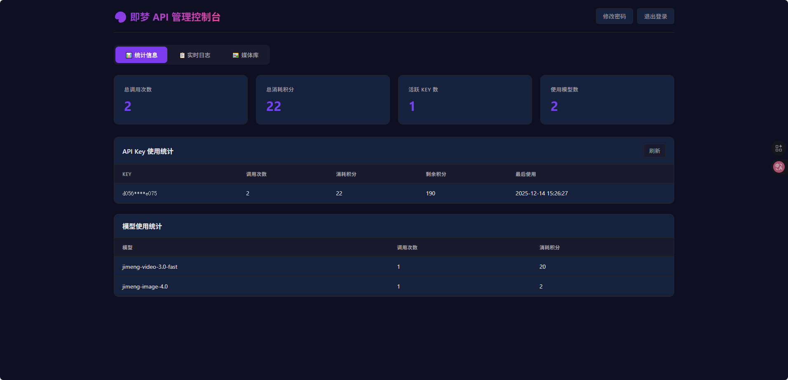
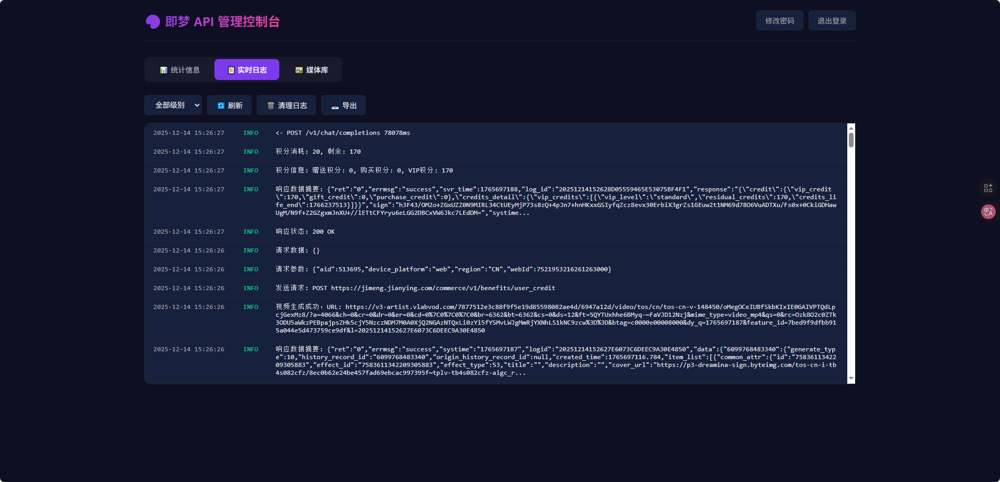
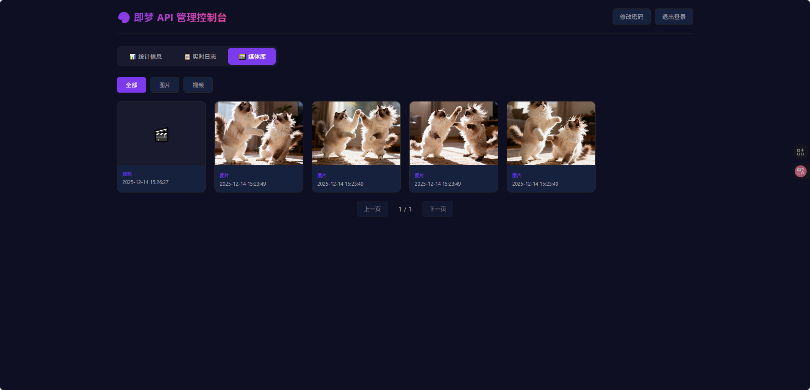

# Jimeng AI Free 服务

[](LICENSE)


> **本项目基于 [LLM-Red-Team/jimeng-free-api](https://github.com/LLM-Red-Team/jimeng-free-api) 二次开发，感谢原作者的贡献！请有项目交流需求的朋友 email 获取入群 QR，zinanzhi@gmail.com**

---

> 支持即梦超强图像生成能力，提供 5 款图像模型（4.5/4.1/4.0/3.1/3.0）和 5 款视频模型（3.0 Pro/3.0/3.0 Fast/S2.0/2.0 Pro），目前官方每日赠送 66 积分，可生成次数请查询 Jimeng 官网模型消耗积分数量，零配置部署，多路 token 支持，网页管理&统计功能。

---

## 🎛️ 管理控制台

本项目提供了功能完善的 **Web 管理控制台**，支持统计分析、日志查看、媒体库管理等功能。

### 界面预览

<table>
<tr>
<td></td>
<td></td>
<td></td>
</tr>
<tr>
<td align="center"><b>登录界面</b></td>
<td align="center"><b>统计面板</b></td>
<td align="center"><b>媒体库</b></td>
</tr>
</table>

### 功能特点

| 功能模块        | 说明                                                                     |
| --------------- | ------------------------------------------------------------------------ |
| 🔐 **安全登录** | 首次访问设置管理员账号密码，支持密码修改                                 |
| 📊 **统计分析** | 实时显示 API 调用次数、消耗积分、剩余积分、Key 使用统计、模型使用统计    |
| 📝 **实时日志** | 查看系统日志，支持按级别筛选（INFO/WARN/ERROR），自动刷新，一键清理/导出 |
| 🖼️ **媒体库**   | 浏览所有生成的图片和视频，支持分页、类型筛选、点击预览原图/视频          |

### 访问地址

启动服务后访问：`http://localhost:8000`

首次访问需要设置管理员账号密码，设置完成后登录即可使用所有功能。

---

**新功能**：

- ✅ 图像参考图/混合生成（通过 `filePath` 参数）
- ✅ 视频首尾帧定制（通过 `file_paths` 参数）
- ✅ 支持 OpenAI 多模态消息格式（Chat API 自动提取图片）
- ✅ 即梦官网的最新视频和图像模型
- ✅ **智能比例检测**：提示词中包含比例关键词会自动调整尺寸
  - 图像支持：`21:9`、`16:9`、`3:2`、`4:3`、`1:1`、`3:4`、`2:3`、`9:16`
  - 视频支持：`16:9`、`9:16`、`1:1`、`4:3`、`3:4`、`21:9`
  - 中文关键词：`横屏`、`竖屏`、`方形` 等
- ✅ **智能时长检测**：提示词中包含 `5秒` 或 `10秒` 会自动调整视频时长
- ✅ **智能分辨率**：4.x 图像模型默认 2K，3.x 模型默认 1K
- ✅ **积分追踪**：自动记录每次请求消耗积分和剩余积分
- ✅ **Web 管理控制台**：统计分析、实时日志、媒体库管理

与 OpenAI 接口完全兼容。

## 支持的模型

### 图像生成模型

| 模型名称           | 说明                  | 分辨率 |
| ------------------ | --------------------- | ------ |
| `jimeng-image-4.5` | 即梦 4.5 版本（最新） | 2K     |
| `jimeng-image-4.1` | 即梦 4.1 版本         | 2K     |
| `jimeng-image-4.0` | 即梦 4.0 版本         | 2K     |
| `jimeng-image-3.1` | 即梦 3.1 版本         | 1K     |
| `jimeng-image-3.0` | 即梦 3.0 版本         | 1K     |

### 视频生成模型

| 模型名称                | 说明                 | 支持时长   |
| ----------------------- | -------------------- | ---------- |
| `jimeng-video-3.0-pro`  | 即梦视频 3.0 Pro     | 5 秒/10 秒 |
| `jimeng-video-3.0`      | 即梦视频 3.0         | 5 秒/10 秒 |
| `jimeng-video-3.0-fast` | 即梦视频 3.0 快速版  | 5 秒/10 秒 |
| `jimeng-video-s2.0`     | 即梦视频 S2.0 轻量版 | 仅 5 秒    |
| `jimeng-video-2.0-pro`  | 即梦视频 2.0 Pro     | 仅 5 秒    |

> **视频时长**：3.0 系列模型支持 5 秒和 10 秒（默认 10 秒），2.0 系列模型仅支持 5 秒。可通过 `duration` 参数或在提示词中指定（如 `5秒`、`10秒`）。

### 支持的图像比例

在提示词中包含比例关键词（如 `16:9`、`横屏`）可自动调整尺寸。

**4.x 模型 (2K 分辨率)**：

| 比例 | 尺寸      |
| ---- | --------- |
| 21:9 | 3024×1296 |
| 16:9 | 2560×1440 |
| 3:2  | 2496×1664 |
| 4:3  | 2304×1728 |
| 1:1  | 2048×2048 |
| 3:4  | 1728×2304 |
| 2:3  | 1664×2496 |
| 9:16 | 1440×2560 |

**3.x 模型 (1K 分辨率)**：

| 比例 | 尺寸      |
| ---- | --------- |
| 21:9 | 2016×846  |
| 16:9 | 1664×936  |
| 3:2  | 1584×1056 |
| 4:3  | 1472×1104 |
| 1:1  | 1328×1328 |
| 3:4  | 1104×1472 |
| 2:3  | 1056×1584 |
| 9:16 | 936×1664  |

> **提示词关键字**：`横屏`/`宽屏` → 16:9，`竖屏`/`手机` → 9:16，`方形` → 1:1

## 免责声明

**逆向 API 是不稳定的，建议前往即梦 AI 官方 https://jimeng.jianying.com/ 体验功能，避免封禁的风险。**

**本组织和个人不接受任何资金捐助和交易，此项目是纯粹研究交流学习性质！**

**仅限自用，禁止对外提供服务或商用，避免对官方造成服务压力，否则风险自担！**

## 接入准备

从 [即梦](https://jimeng.jianying.com/) 获取 sessionid

进入即梦登录账号，然后 F12 打开开发者工具，从 Application > Cookies 中找到`sessionid`的值，这将作为 Authorization 的 Bearer Token 值：`Authorization: Bearer sessionid`

### 多账号接入

你可以通过提供多个账号的 sessionid 并使用`,`拼接提供：

`Authorization: Bearer sessionid1,sessionid2,sessionid3`

每次请求服务会从中挑选一个。

## Docker 部署

使用预构建的 Docker 镜像一键部署：

```bash
docker run -it -d --init --name jimeng-free-api \
  -p 8001:8000 \
  -v jimeng-data:/app/data \
  -e TZ=Asia/Shanghai \
  ghcr.io/zhizinan1997/jimeng-free-api-all:latest
```

> **参数说明**：
>
> - `-p 8001:8000`：端口映射，可根据需要修改
> - `-v jimeng-data:/app/data`：持久化数据（统计、媒体记录、用户信息）
> - `-e TZ=Asia/Shanghai`：设置时区为上海

## 管理控制台

> 详细功能介绍和界面预览请参阅文档开头的 [🎛️ 管理控制台](#%EF%B8%8F-管理控制台重点功能) 章节。

部署后访问 `http://localhost:8001`（或您配置的端口）即可打开管理控制台。

**数据持久化**：所有数据存储在 SQLite 数据库中（`/app/data/jimeng.db`），使用 Docker Volume 挂载可确保数据持久化。

## 接口列表

所有接口都需要在 Header 中设置 Authorization：

```
Authorization: Bearer [sessionid]
```

### 对话补全接口（推荐）

**POST /v1/chat/completions**

这是最主要的接口，与 OpenAI Chat Completions API 完全兼容。根据选择的模型自动生成图像或视频。

#### 生成图像

使用图像模型（如 `jimeng-4.5`、`jimeng` 等）：

```json
{
  "model": "jimeng-4.5",
  "messages": [
    {
      "role": "user",
      "content": "一只可爱的柴犬在草地上奔跑"
    }
  ]
}
```

#### 生成视频

使用视频模型（如 `jimeng-video-3.0` 等）：

```json
{
  "model": "jimeng-video-3.0",
  "messages": [
    {
      "role": "user",
      "content": "一只小猫在阳光下打盹"
    }
  ]
}
```

#### 带参考图生成图像（多模态）

在消息中附带图片，第一张图片将作为参考图：

```json
{
  "model": "jimeng-4.5",
  "messages": [
    {
      "role": "user",
      "content": [
        { "type": "text", "text": "将这张图片转换为水彩画风格" },
        { "type": "image_url", "image_url": { "url": "图片URL或base64" } }
      ]
    }
  ]
}
```

#### 带首尾帧生成视频（多模态）

在消息中附带图片，系统会自动提取作为首尾帧：

```json
{
  "model": "jimeng-video-3.0",
  "messages": [
    {
      "role": "user",
      "content": [
        { "type": "text", "text": "生成一个从日出到日落的延时摄影" },
        { "type": "image_url", "image_url": { "url": "首帧图片" } },
        { "type": "image_url", "image_url": { "url": "尾帧图片" } }
      ]
    }
  ]
}
```

> **支持的图片格式**：网络 URL、本地文件路径、Base64 编码

### 获取模型列表

**GET /v1/models**

返回所有可用的图像和视频生成模型。
