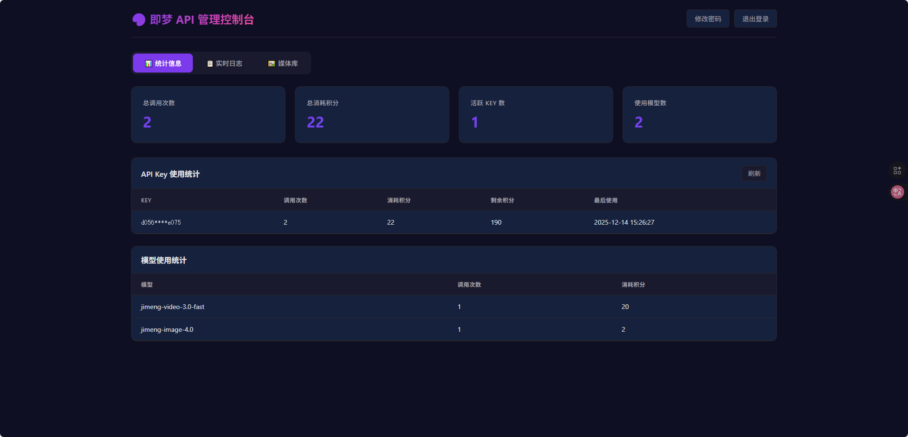
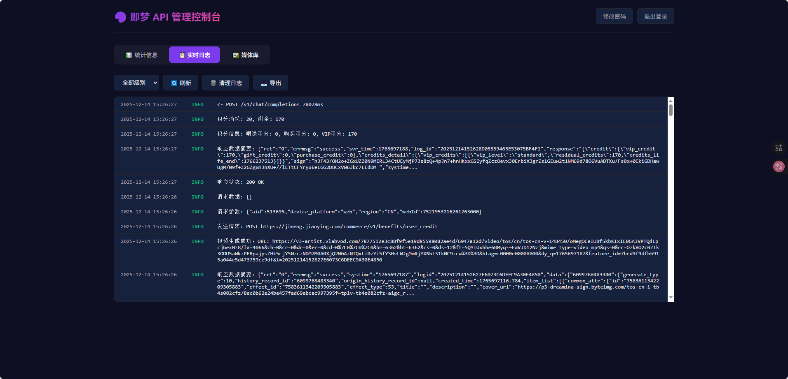
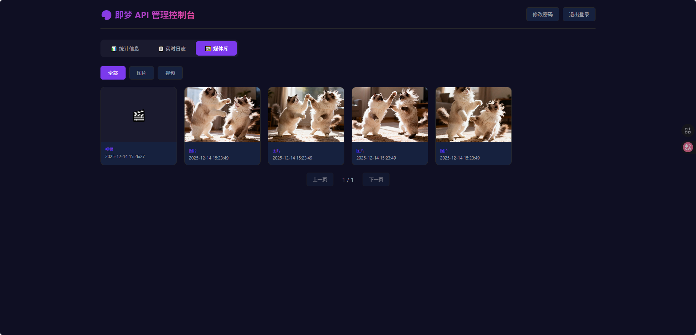

# Jimeng AI Free 服务

<div align="center">

[](LICENSE)


> **本项目基于 [LLM-Red-Team/jimeng-free-api](https://github.com/LLM-Red-Team/jimeng-free-api) 二次开发，感谢原作者的贡献！**
>
> **请有项目交流需求的朋友 email 获取入群 QR，<zinanzhi@gmail.com>**

</div>

---

## 更新日志

### 2026-06-24

- **适配即梦官网新图片模型**：新增 `jimeng-image-5.0-lite`（`high_aes_general_v50`），并补充 `jimeng-image-4.7`、`jimeng-image-4.6`；图片默认模型更新为 5.0 Lite，4.x/5.x 支持 2K 默认与 4K 请求。
- **补充 Seedance 视频模型接口**：新增 `jimeng-video-seedance-2.0-mini`、`jimeng-video-seedance-2.0-fast`、`jimeng-video-seedance-2.0-pro`、`jimeng-video-seedance-1.5-pro`，并适配对应 `model_req_key`、分辨率和权益 `benefit_type`。
- **新增官网动态模型列表**：`GET /v1/models` 在带 `Authorization` 时会实时拉取即梦官网图片/视频模型配置并缓存；支持 `?refresh=true` 强制刷新，支持 `?type=image` / `?type=video` 过滤；无 token 或官网失败时自动返回内置兜底模型。
- **生成接口接入动态模型映射**：图片和视频生成会优先使用官网动态配置中的 `model_req_key`、分辨率和权益信息，静态映射继续作为兜底，减少官网新增模型后必须改代码的概率。
- **更新请求版本参数**：图片与视频生成请求统一更新为 `web_version=7.5.0`、`da_version=3.3.20`，同步当前官网请求格式。
- **增强鲁棒性**：优化 `Authorization` 多 token 解析，自动 trim 并过滤空 token；聊天、图片、视频、积分查询路由会拒绝空 token；视频轮询兼容 `20/42/45` 处理中状态，避免死循环，并在生成结束但没有 URL 时明确抛错。
- **优化自动降级策略**：图片/视频根据模型实际支持的分辨率做降级，避免对不支持的档位重复请求或意外从最高档开始消耗积分。

### 2026-01-11

- 🐛 **修复混合模式模型选择问题**：之前上传参考图时会强制使用 3.0 模型，现在支持所有模型的混合生成模式
- ✨ **新增 2.0-pro 模型支持**：添加 `jimeng-image-2.0-pro` 模型，强制使用 1k 分辨率
- 🔧 **适配即梦官方 API 更新**：统一所有模型的 `metrics_extra` 请求格式，添加 `sceneOptions` 字段
- 📝 **优化日志输出格式**：使用 emoji 图标和结构化格式，日志更清晰易读
- 🐳 **优化 Docker 镜像体积**：从 ~700MB 优化至 ~280MB（多阶段构建、精简依赖）

> ⚠️ **已知问题**：4.x 模型请求 2K 分辨率时，部分账号可能被即梦服务端拒绝（返回积分不足错误码 1006），系统会自动降级到 1K 分辨率。此问题可能与账号类型或即梦服务端策略相关，暂无法解决。

### 2026-01-06

- 🐛 **修复 4.x 模型 2K 分辨率积分误报**：完善 `metrics_extra` 请求结构参数，添加 `sceneOptions`、`benefitCount` 等关键字段，解决 4.x 系列模型（4.0/4.1/4.5）请求 2K 分辨率时被错误降级到 1K 的问题

### 2026-01-04

- 🐛 **修复积分不足误报**：适配即梦官方 API 错误码变更（`5000` → `1006`），现在能正确识别积分不足并自动降级到 1K 分辨率重试
- 🐛 **修复图像自动降级**：Chat 接口启用 `generateImagesWithRetry`，支持 2K→1K 自动降级
- 🐛 **修复视频生成崩溃**：修复多模态消息（图片+文本）导致的 `content.substring is not a function` 错误

---

## 📖 项目简介

**Jimeng AI Free** 是一个强大的即梦（Jimeng）AI 接口服务，旨在提供便捷的图像和视频生成能力。

🚀 **核心亮点**：

- **超强模型支持**：集成 5 款图像模型（4.5/4.1/4.0/3.1/3.0）和 5 款视频模型（3.0 Pro/3.0/3.0 Fast/S2.0/2.0 Pro）。
- **完全免费体验**：目前官方每日赠送 66 积分，支持多路 Token 轮询，最大化利用免费额度。
- **可视化管理**：内置功能强大的 Web 管理控制台，支持实时监控和媒体管理。
- **OpenAI 兼容**：完全兼容 OpenAI 接口格式，可直接接入大多数现有 AI 应用。
- **零配置部署**：通过 Docker 一键启动，开箱即用。

---

## 🎛️ 管理控制台（重点功能）

本项目提供了功能完善的 **Web 管理控制台**，为您提供全方位的服务监控和管理能力。

### 📊 界面预览

<table align="center">
<tr>
<td align="center"></td>
<td align="center"></td>
<td align="center"></td>
</tr>
<tr>
<td align="center"><b>🔐 安全登录</b><br/>首次访问设置管理员密码</td>
<td align="center"><b>📈 实时统计</b><br/>调用次数、积分追踪、Key状态</td>
<td align="center"><b>🎬 媒体库</b><br/>生成历史、实时预览、筛选</td>
</tr>
</table>

### ✨ 功能特点

| 功能模块        | 说明                                                                                                      |
| :-------------- | :-------------------------------------------------------------------------------------------------------- |
| **📊 统计分析** | 实时大屏显示总调用量、总积分消耗。详细记录每个 API Key 的剩余积分和最后使用时间，支持按模型统计用量。     |
| **📝 实时日志** | 实时查看系统运行日志，支持按 `INFO` / `WARN` / `ERROR` 级别筛选，支持自动刷新和一键清理/导出日志文件。    |
| **🖼️ 媒体回溯** | 所有生成的图片和视频都会自动记录在媒体库中，支持按类型（图片/视频）筛选，点击即可预览高清原图或播放视频。 |
| **💳 积分追踪** | **[NEW]** 每次请求自动计算并记录消耗积分，实时更新 Token 的剩余积分，精准掌握额度使用情况。               |

### 🚀 访问地址

部署成功后，访问：`http://localhost:8001`（默认端口）即可进入管理控制台。

---

## ✨ 功能特性

### 🎨 图像与视频生成

- **多模型支持**：涵盖即梦官网最新发布的所有视频和图像模型。
- **混合生成**：支持参考图生成（Image-to-Image），通过 `filePath` 参数传递。
- **视频定制**：支持设置视频首尾帧（Image-to-Video），通过 `file_paths` 参数传递。
- **智能分辨率**：4.x 图像模型默认 2K 高清，3.x 模型默认 1K。
- **智能时长**：提示词包含 `5秒` 或 `10秒` 关键词时，自动调整视频生成时长。

### 📐 智能比例检测

系统会自动识别提示词中的比例关键词，并调整生成尺寸：

- **图片支持**：`21:9`、`16:9`、`3:2`、`4:3`、`1:1`、`3:4`、`2:3`、`9:16`
- **视频支持**：`16:9`、`9:16`、`1:1`、`4:3`、`3:4`、`21:9`
- **中文关键词**：支持 `横屏`、`竖屏`、`方形` 等自然语言指令。

### 🤖 开发友好

- **标准化接口**：`/v1/chat/completions` 接口完全兼容 OpenAI 规范。
- **多模态消息**：支持标准的多模态消息格式，自动提取消息中的图片作为参考图或首尾帧。

---

## 🛠️ Docker 部署

使用预构建镜像一键启动：

```bash
docker run -it -d --init --name jimeng-free-api \
  -p 8001:8000 \
  -v jimeng-data:/app/data \
  -e TZ=Asia/Shanghai \
  ghcr.io/zhizinan1997/jimeng-free-api-all:latest
```

**参数说明**：

- `-p 8001:8000`：可以修改冒号前的端口（如 `-p 8080:8000`）。
- `-v jimeng-data:/app/data`：**强烈建议挂载**，用于持久化保存统计数据、媒体记录和管理员密码。
- `-e TZ=Asia/Shanghai`：设置时区，确保日志和统计时间准确。

---

## 📦 本地开发部署

如果您希望在本地运行或进行二次开发，请按照以下步骤操作：

### 1. 克隆仓库

```bash
git clone https://github.com/zhizinan1997/jimeng-free-api-all.git
cd jimeng-free-api-all
```

### 2. 安装依赖

需要 Node.js 环境（推荐 v16+）：

```bash
npm install
```

### 3. 构建项目

```bash
npm run build
```

### 4. 启动服务

```bash
npm start
```

启动成功后，服务将在 `http://localhost:8000` 运行。

---

## 🧩 支持的模型列表

### 🖼️ 图像生成

| 模型名称               | 说明                      | 分辨率    |
| :--------------------- | :------------------------ | :-------- |
| `jimeng-image-5.0-lite` | 即梦 5.0 Lite 版本（最新） | 2K (默认) / 4K |
| `jimeng-image-4.7`     | 即梦 4.7 版本             | 2K (默认) / 4K |
| `jimeng-image-4.6`     | 即梦 4.6 版本             | 2K (默认) / 4K |
| `jimeng-image-4.5`     | 即梦 4.5 版本             | 2K (默认) / 4K |
| `jimeng-image-4.1`     | 即梦 4.1 版本             | 2K (默认) / 4K |
| `jimeng-image-4.0`     | 即梦 4.0 版本             | 2K (默认) / 4K |
| `jimeng-image-3.1`     | 即梦 3.1 版本             | 1K (默认) |
| `jimeng-image-3.0`     | 即梦 3.0 版本             | 1K (默认) |
| `jimeng-image-2.0-pro` | 即梦 2.0 Pro 版本         | 仅支持 1K |

### 🎥 视频生成

| 模型名称                | 说明           | 支持时长 |
| :---------------------- | :------------- | :------- |
| `jimeng-video-seedance-2.0-mini` | Seedance 2.0 Mini | 5s / 10s |
| `jimeng-video-seedance-2.0-fast` | Seedance 2.0 Fast VIP | 5s / 10s |
| `jimeng-video-seedance-2.0-pro`  | Seedance 2.0 VIP | 5s / 10s |
| `jimeng-video-seedance-1.5-pro`  | Seedance 1.5 Pro | 5s / 10s |
| `jimeng-video-3.0-pro`  | 3.0 Pro 专业版 | 5s / 10s |
| `jimeng-video-3.0`      | 3.0 标准版     | 5s / 10s |
| `jimeng-video-3.0-fast` | 3.0 快速版     | 5s / 10s |
| `jimeng-video-s2.0`     | S2.0 轻量版    | 5s       |
| `jimeng-video-2.0-pro`  | 2.0 Pro 版     | 5s       |

---

## 🔑 接入指南

### 1. 获取 Session ID

1. 访问 [即梦官网](https://jimeng.jianying.com/) 并登录。
2. 按 `F12` 打开开发者工具，进入 `Application` > `Cookies`。
3. 找到 `sessionid` 的值。

### 2. 配置 Authorization

在请求 Header 中使用 Bearer Token 方式鉴权：

```http
Authorization: Bearer sessionid_value
```

**多账号支持**：
如果有多个账号，可以用逗号分隔多个 sessionid，服务会自动轮询使用：

```http
Authorization: Bearer sessionid_1,sessionid_2,sessionid_3
```

---

## 📝 API 接口文档

### 1. 对话补全 (生成图像/视频)

**POST** `/v1/chat/completions`

#### 简单示例

```json
{
  "model": "jimeng-4.5",
  "messages": [
    {
      "role": "user",
      "content": "一只在太空中飞行的柴犬，赛博朋克风格"
    }
  ]
}
```

#### 多模态示例 (带参考图)

```json
{
  "model": "jimeng-4.5",
  "messages": [
    {
      "role": "user",
      "content": [
        { "type": "text", "text": "将这张图变成梵高风格" },
        {
          "type": "image_url",
          "image_url": { "url": "https://example.com/image.jpg" }
        }
      ]
    }
  ]
}
```

### 2. 获取模型列表

**GET** `/v1/models`

返回所有可用模型及其配置信息。

默认返回内置兜底模型列表；如果请求带有即梦 `Authorization`，服务会实时拉取官网图片/视频模型配置并缓存结果。可使用 `?refresh=true` 强制刷新缓存，使用 `?type=image` 或 `?type=video` 只返回指定类型模型。

---

## ⚠️ 免责声明

1. **服务稳定性**：本项目基于逆向 API 开发，不保证永久可用。建议优先使用 [即梦官方服务](https://jimeng.jianying.com/)。
2. **非盈利性质**：本项目仅供个人研究交流学习，不接受任何形式的捐助，不用于商业用途。
3. **使用规范**：请遵守相关法律法规，禁止生成违规内容。任何因使用本项目产生的后果由使用者自行承担。

---

<div align="center">
  <sub>Released under the MIT License.</sub>
</div>
